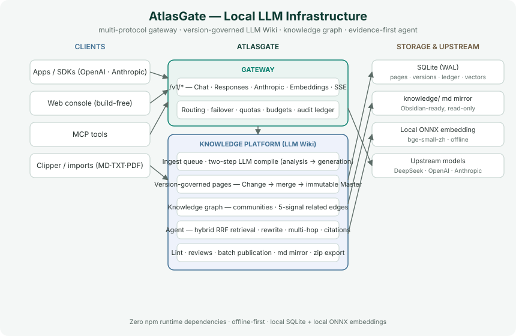

# AtlasGate

[中文版 Chinese](README.md)

AtlasGate is local LLM infrastructure for small engineering teams: a multi-protocol OpenAI/Anthropic API gateway, a version-governed **LLM Wiki** (Karpathy methodology), a knowledge graph, and an evidence-first knowledge agent.

- The design is informed by [Karpathy's LLM Wiki](https://gist.github.com/karpathy/442a6bf555914893e9891c11519de94f), `llm-wiki-skill`, and `llm_wiki`; the implementation is independent.
- See the [reference capability matrix](docs/en-US/REFERENCE_MATRIX.md) and [architecture decisions](docs/en-US/DECISIONS.md).

## Overview

Most RAG systems answer by re-reading raw documents on every query, so knowledge never accumulates. AtlasGate instead follows Karpathy's LLM Wiki methodology: an LLM **compiles** ingested sources into a continuously maintained wiki — entities, concepts, source summaries, and system pages (`index.md` / `log.md` / `overview.md`) — governed by a versioned Change → merge → immutable-Master audit chain. The knowledge agent retrieves from that compiled wiki with citations, offline-first, with zero npm runtime dependencies.



## Capabilities

| Component | Highlights |
| --- | --- |
| Multi-protocol gateway | Chat Completions, Responses, Anthropic Messages, Embeddings, SSE, model listing, token counting |
| Smart routing | Vision filtering, quality/cost/latency/reliability scoring, credential pools, cooldowns, bounded failover, per-attempt audit |
| Usage governance | Client-key scopes, model allowlists, RPM/TPM, token quotas, monthly budgets, revocation, retained audit, upstream balance |
| LLM Wiki compiler | Two-step analysis → generation, persistent ingest queue, SHA256 dedup, per-KB `review`/`auto` modes, batch review, Lint, source traceability |
| Version governance | Multi-user Changes, optimistic concurrency, conflict ledger, tombstones, versioned documents and graph |
| Knowledge graph | Pure-JS ForceAtlas2 layout, Louvain communities, 5-signal related edges, search/drag/hover/minimap |
| Knowledge agent | Hybrid retrieval — lexical bigram + local dense page vectors fused by **RRF**, pseudo-rerank, zero-evidence query rewriting, wikilink **multi-hop**, evidence-sufficiency discipline |
| Memory × knowledge loop | Q&A auto-sedimentation into the wiki (≥3 similar questions or explicit request), `query_hits` usage heat, skill-declared retrieval strategy (ADR-015) |
| Console & disk | Build-free 8-view web console, Obsidian-ready `knowledge/` md mirror, ZIP export, MCP |

## Quick start

Requirements: **Node.js 24+** and **Python 3.11+** (auto-detects `python` / `python3`). No npm dependencies.

```bash
npm start
```

Open **http://127.0.0.1:4310** — console defaults `admin / atlasgate-admin`; gateway key `atlasgate-dev-key`.

## Installation & configuration (complete checklist)

### 1. Base runtime (required)

| Dependency | Version | Purpose | Install |
| --- | --- | --- | --- |
| Node.js | 24+ (with `node:sqlite`) | Server | official site / package manager |
| Python | 3.11+ | Agent core & PDF parsing (stdlib only) | official site / package manager |
| npm deps | none | — | **no `npm install` needed** |
| pypdf | vendored (`python/vendor/`) | PDF parsing | **nothing to install** |

```bash
npm start   # zero-config; the offline mock validates the whole chain
```

### 2. Dense-retrieval embedding (recommended — activates real semantic vectors)

Retrieval defaults to `hybrid` (lexical + dense RRF). **Without an embedding service it degrades to pure lexical**; the steps below activate real semantic vectors (the dev machine runs exactly this setup).

**① Create a venv and install runtimes** (with `uv`, or system `venv` + pip):

```bash
uv venv .venv-embed --python 3.12
uv pip install --python .venv-embed/bin/python torch --index-url https://download.pytorch.org/whl/cpu
uv pip install --python .venv-embed/bin/python transformers
uv pip install --python .venv-embed/bin/python onnxruntime   # optional: only needed for the ONNX path
```

**② Download bge-small-zh-v1.5 weights** (~95MB, ModelScope):

```bash
mkdir -p python/models/bge-small-zh-v1.5 && cd python/models/bge-small-zh-v1.5
for f in config.json model.safetensors tokenizer.json tokenizer_config.json vocab.txt \
         special_tokens_map.json modules.json sentence_bert_config.json; do
  curl -fL -O "https://modelscope.cn/models/BAAI/bge-small-zh-v1.5/resolve/master/$f"
done
cd - >/dev/null
```

**③ Start the embedding worker** (background, port 8031):

```bash
setsid nohup .venv-embed/bin/python python/atlasgate_agent/embedding_worker.py \
  --model python/models/bge-small-zh-v1.5 --port 8031 > /tmp/embed-worker.log 2>&1 &
curl http://127.0.0.1:8031/health        # {"status":"ok","dims":512}
```

**④ Start AtlasGate against it and verify**:

```bash
ATLASGATE_EMBEDDING_BASE_URL=http://127.0.0.1:8031/v1 npm start
curl http://127.0.0.1:4310/health | python3 -c 'import json,sys; print(json.load(sys.stdin)["retrieval"])'
# expect: {"mode":"hybrid","enabled":true,"backend":"local",...}
```

> The semantic index (`semantic_vectors`) builds lazily on the first ask, or manually via `POST /api/knowledge-bases/:id/semantic-index`. `embedding_worker.py` supports **PyTorch (transformers) or ONNX** backends, auto-detected. Model weights and the venv are gitignored.

### 3. Optional configuration

| Option | Notes |
| --- | --- |
| External embedding API | Any OpenAI-compatible `/v1/embeddings`: point `ATLASGATE_EMBEDDING_BASE_URL` at it (e.g. OpenAI `text-embedding-3-small`). DeepSeek has no embedding model |
| Qdrant backend | `ATLASGATE_RETRIEVAL_MODE=qdrant` + `ATLASGATE_QDRANT_URL` (vectors in Qdrant instead of local SQLite) |
| Docker | `cp .env.example .env && docker compose up -d --build` (see docs/en-US/DEPLOYMENT.md) |
| Real model routing | Add an OpenAI-compatible Provider in the console (e.g. DeepSeek `deepseek-chat`) to enable LLM compilation and agent answers |
| Query rewrite / sedimentation | On by default; `ATLASGATE_QUERY_REWRITE_ENABLED` / `ATLASGATE_QUERY_SEDIMENT_ENABLED` to disable |

## Reproducible module examples

> Verified against the default development config. Log in once, then reuse the session with `-b cookies.txt`:

```bash
curl -c cookies.txt -X POST http://127.0.0.1:4310/api/auth/login \
  -H 'content-type: application/json' -d '{"username":"admin","password":"atlasgate-admin"}'
```

### 1. Model gateway (`/v1`, local mock)

```bash
curl http://127.0.0.1:4310/v1/chat/completions \
  -H "Authorization: Bearer atlasgate-dev-key" -H 'content-type: application/json' \
  -d '{"model":"auto","messages":[{"role":"user","content":"ping"}]}'
```

### 2. Knowledge base & version governance (create → import → publish)

```bash
KB=$(curl -b cookies.txt -X POST http://127.0.0.1:4310/api/knowledge-bases \
  -H 'content-type: application/json' -d '{"name":"Demo","ingest_mode":"review"}' \
  | python3 -c 'import json,sys; print(json.load(sys.stdin)["id"])')
curl -b cookies.txt -X POST "http://127.0.0.1:4310/api/knowledge-bases/$KB/import" \
  -H 'content-type: application/json' \
  -d '{"filename":"intro.md","media_type":"text/markdown","data_base64":"IyBBdGxhc0dhdGUg5YWl6ZeoCgpBdGxhc0dhdGUg5piv6Z2i5ZCR5bCP5Z6L5Zui6Zif55qE5pys5ZywIExNTSDln7rnoYDorr7mlr3vvJrlpJrljY/orq7nvZHlhbMgKyDniYjmnKzljJYgTExNIFdpa2kgKyDnn6Xor4YgQWdlbnTjgIIK","author":"tester"}'
curl -b cookies.txt -X POST "http://127.0.0.1:4310/api/knowledge-bases/$KB/merge" \
  -H 'content-type: application/json' -d '{"summary":"first publish"}'
```

### 3. LLM Wiki ingest (two-step compile; degrades to a raw archive page without a real model)

```bash
curl -b cookies.txt -X POST "http://127.0.0.1:4310/api/knowledge-bases/$KB/ingest" \
  -H 'content-type: application/json' \
  -d '{"kind":"paste","filename":"material.md","text":"Xiang Dingtian found half a stone wall at the bottom of a dry well."}'
curl -b cookies.txt "http://127.0.0.1:4310/api/knowledge-bases/$KB/ingest-queue?limit=5"
curl -b cookies.txt "http://127.0.0.1:4310/api/knowledge-bases/$KB/pages"
```

### 4. Knowledge agent ask + Q&A sedimentation (ADR-015)

```bash
curl -b cookies.txt -X POST http://127.0.0.1:4310/api/agents/knowledge/ask \
  -H 'content-type: application/json' \
  -d "{\"kb_id\":\"$KB\",\"question\":\"What is AtlasGate\",\"save_to_wiki\":true}"
# response includes saved_to_wiki (a queries/ page; pending in review KBs)
```

### 5. Knowledge graph & usage heat

```bash
curl -b cookies.txt "http://127.0.0.1:4310/api/knowledge-bases/$KB/graph" \
  | python3 -m json.tool | grep -E '"(path|query_hits|community)"' | head
```

### 6. Hybrid retrieval (lexical + dense RRF)

```bash
curl -b cookies.txt -X POST "http://127.0.0.1:4310/api/knowledge-bases/$KB/search" \
  -H 'content-type: application/json' -d '{"query":"stone wall clue","top_k":5}'
```

### 7. Skills with a retrieval strategy (ADR-015)

```bash
SKILL=$(curl -b cookies.txt -X POST http://127.0.0.1:4310/api/skills \
  -H 'content-type: application/json' \
  -d '{"name":"deep-8","description":"fetch 8 pages","instructions":"answer from evidence","retrieval":{"top_k":8,"multihop":true}}' \
  | python3 -c 'import json,sys; print(json.load(sys.stdin)["id"])')
curl -b cookies.txt -X POST "http://127.0.0.1:4310/api/agents/knowledge-agent/skills/$SKILL" \
  -H 'content-type: application/json' -d '{"attached":true}'
```

### 8. Upstream balance & semantic index

```bash
curl -b cookies.txt -X POST http://127.0.0.1:4310/api/providers/prv_30bebf0038914b319047/balance -H 'content-type: application/json' -d '{}'
curl -b cookies.txt -X POST "http://127.0.0.1:4310/api/knowledge-bases/$KB/semantic-index" -H 'content-type: application/json' -d '{}'
```

### 9. md mirror & export (Obsidian)

```bash
curl -b cookies.txt -X POST "http://127.0.0.1:4310/api/knowledge-bases/$KB/sync" -H 'content-type: application/json' -d '{}'
curl -b cookies.txt -o wiki.zip "http://127.0.0.1:4310/api/knowledge-bases/$KB/export"
unzip -l wiki.zip | head
```

## Documentation

- **English docs** — [docs/en-US/README.md](docs/en-US/README.md) · [Getting started](docs/en-US/GETTING_STARTED.md)
- **中文文档导航** — [docs/zh-CN/README.md](docs/zh-CN/README.md) · [从零复现](docs/zh-CN/GETTING_STARTED.md)
- Feature tracking — [guides/FEATURE_MATRIX.md](docs/zh-CN/guides/FEATURE_MATRIX.md) · Architecture decisions (ADR-001~015) — [DECISIONS.md](docs/zh-CN/DECISIONS.md)

## Storage & boundaries

Knowledge pages are versioned in SQLite at `data/atlasgate.db`. `knowledge/<kb>/` is a read-only Markdown mirror generated after publication; ZIP export is available from the console.

AtlasGate is a single-node modular monolith. The console targets loopback / trusted private networks; public deployment needs an authenticated admin plane, TLS, egress controls, and application-level secret protection (see [SECURITY.md](docs/en-US/SECURITY.md)). Provider credentials are not encrypted at the application layer.

## Tests

```bash
npm test          # Node + Python suites
npm run check     # syntax + gate
```

See [TEST_PLAN.md](docs/zh-CN/TEST_PLAN.md) / [TEST_REPORT.md](docs/zh-CN/TEST_REPORT.md). Current: **Node 92 · Python 19**.

## License

[MIT](LICENSE)
