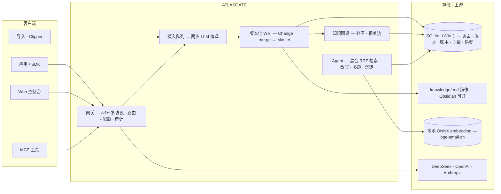

# AtlasGate

**面向小型研发团队的本地 LLM 基础设施**：OpenAI / Anthropic 多协议 API 网关 + 具备协作版本治理、LLM 自动编译与关系图谱的知识库（LLM Wiki）+ 默认引用证据的知识 Agent。

[English](README.en-US.md) · [中文文档导航](docs/zh-CN/README.md)

---

## 项目介绍

传统 RAG 每次查询都从原始文档现取现答，**知识不会积累**。AtlasGate 遵循 Karpathy 的 [LLM Wiki](https://gist.github.com/karpathy/442a6bf555914893e9891c11519de94f) 方法论：LLM 把摄入的素材**编译**成持续维护的 Wiki——实体页、概念页、素材摘要页，以及 `index.md` / `log.md` / `overview.md` 系统页——全部经由版本化审计链（Change → merge → 不可变 Master）治理。知识 Agent 从这份编译后的知识库检索并带引用回答，**离线优先、零 npm 运行依赖**。

> 设计参考 [Karpathy's LLM Wiki](https://gist.github.com/karpathy/442a6bf555914893e9891c11519de94f)、[`llm-wiki-skill`](https://github.com/sdyckjq-lab/llm-wiki-skill)、[`llm_wiki`](https://github.com/nashsu/llm_wiki)；实现为独立设计。


## 核心能力

| 组件 | 亮点 |
| --- | --- |
| **多协议网关** | Chat Completions · Responses · Anthropic Messages · Embeddings · SSE · 模型列表 · Token 计数 |
| **智能路由** | 视觉能力过滤、质量/成本/延迟/可靠性评分、凭据池、冷却与有界 Failover、每次 attempt 留痕 |
| **用量治理** | 客户端密钥 scope · 模型白名单 · RPM/TPM · Token 配额 · 月预算 · 撤销 · 审计保留 · 上游余额展示 |
| **LLM Wiki 编译** | 两步编译（分析→生成）、持久化摄入队列、SHA256 去重、per-KB `review`/`auto` 模式、批次审阅、Lint、溯源 |
| **版本治理** | 多用户 Change、乐观并发、冲突账本、tombstone、版本化文档与图谱 |
| **知识图谱** | 纯 JS ForceAtlas2 布局、Louvain 社区、5 信号相关边、搜索/拖拽/悬停/小地图 |
| **知识 Agent** | 混合检索——词法 + 本地稠密页面向量 **RRF** 融合、伪重排、零证据查询改写、wikilink **多跳**扩展、证据充分性约束 |
| **记忆 × 知识闭环** | 问答自动沉淀进 Wiki（相似问题≥3次或显式请求）、图谱引用热度 `query_hits`、技能声明检索策略（ADR-015） |
| **控制台与磁盘** | 免构建 8 视图 Web 控制台、Obsidian 可打开的 `knowledge/` md 镜像、ZIP 导出、MCP |



## 快速开始

要求：**Node.js 24+** 与 **Python 3.11+**（自动探测 `python`/`python3`，无 npm 依赖）。

```bash
npm start
```

打开 **http://127.0.0.1:4310** —— 控制台默认 `admin / atlasgate-admin`；网关 Key `atlasgate-dev-key`。

## 安装与配置（完整清单）

### 1. 基础运行（必装）

| 依赖 | 版本 | 用途 | 安装 |
| --- | --- | --- | --- |
| Node.js | 24+（含 `node:sqlite`） | 服务本体 | 官网/包管理器 |
| Python | 3.11+ | Agent 核心与 PDF 解析（仅标准库） | 官网/包管理器 |
| npm 依赖 | 无 | —— | **无需 npm install** |
| pypdf | 已内置 vendored（`python/vendor/`） | PDF 解析 | **无需安装** |

```bash
npm start   # 零配置即可启动（离线 mock 可验证全链路）
```

### 2. 稠密检索 Embedding（推荐激活，让 hybrid 语义检索真正生效）

检索默认 `hybrid`（词法 + 向量 RRF）。**未配置 embedding 时自动降级为纯词法**；以下步骤激活真实语义向量（本仓库开发机已按此配置运行）。

**① 建 venv 并安装运行时**（用 `uv`，或系统 `venv` + pip）：

```bash
uv venv .venv-embed --python 3.12
uv pip install --python .venv-embed/bin/python torch --index-url https://download.pytorch.org/whl/cpu
uv pip install --python .venv-embed/bin/python transformers
uv pip install --python .venv-embed/bin/python onnxruntime   # 可选：仅使用 ONNX 模型时需要
```

**② 下载 bge-small-zh-v1.5 模型权重**（约 95MB，ModelScope）：

```bash
mkdir -p python/models/bge-small-zh-v1.5 && cd python/models/bge-small-zh-v1.5
for f in config.json model.safetensors tokenizer.json tokenizer_config.json vocab.txt \
         special_tokens_map.json modules.json sentence_bert_config.json; do
  curl -fL -O "https://modelscope.cn/models/BAAI/bge-small-zh-v1.5/resolve/master/$f"
done
cd - >/dev/null
```

**③ 启动 embedding 服务**（后台，端口 8031）：

```bash
setsid nohup .venv-embed/bin/python python/atlasgate_agent/embedding_worker.py \
  --model python/models/bge-small-zh-v1.5 --port 8031 > /tmp/embed-worker.log 2>&1 &
curl http://127.0.0.1:8031/health        # {"status":"ok","dims":512}
```

**④ 以该 embedding 服务启动 AtlasGate 并验证**：

```bash
ATLASGATE_EMBEDDING_BASE_URL=http://127.0.0.1:8031/v1 npm start
curl http://127.0.0.1:4310/health | python3 -c 'import json,sys; print(json.load(sys.stdin)["retrieval"])'
# 期望: {"mode":"hybrid","enabled":true,"backend":"local",...}
```

> 首次提问会自动建立语义索引（`semantic_vectors` 表）；也可手动 `POST /api/knowledge-bases/:id/semantic-index`。`embedding_worker.py` 支持 **PyTorch（transformers）或 ONNX** 两种后端，自动探测。模型与 venv 已 gitignore，不入库。

### 3. 可选配置

| 配置 | 说明 |
| --- | --- |
| 外部 Embedding API | 任意 OpenAI 兼容 `/v1/embeddings`：设 `ATLASGATE_EMBEDDING_BASE_URL` 指向它（如 OpenAI `text-embedding-3-small`）。DeepSeek 官方无 embedding 模型 |
| Qdrant 后端 | `ATLASGATE_RETRIEVAL_MODE=qdrant` + `ATLASGATE_QDRANT_URL`（向量存 Qdrant 而非本地 SQLite） |
| Docker 部署 | `cp .env.example .env && docker compose up -d --build`（见 docs/zh-CN/DEPLOYMENT.md） |
| 真实模型路由 | 控制台「模型网关」添加 OpenAI 兼容 Provider（如 DeepSeek `deepseek-chat`），LLM Wiki 编译与 Agent 回答即生效 |
| 查询改写/问答沉淀 | 默认开启；`ATLASGATE_QUERY_REWRITE_ENABLED` / `ATLASGATE_QUERY_SEDIMENT_ENABLED` 可关 |

## 模块使用示例（照抄即可复现）

> 以下命令在默认开发配置下实测通过。先登录一次并保存会话，后续都用 `-b cookies.txt`：

```bash
curl -c cookies.txt -X POST http://127.0.0.1:4310/api/auth/login \
  -H 'content-type: application/json' -d '{"username":"admin","password":"atlasgate-admin"}'
```

### 1. 模型网关（/v1 调用，本地 mock）

```bash
curl http://127.0.0.1:4310/v1/chat/completions \
  -H "Authorization: Bearer atlasgate-dev-key" -H 'content-type: application/json' \
  -d '{"model":"auto","messages":[{"role":"user","content":"ping"}]}'
```

### 2. 知识库与版本治理（建库 → 导入 → 发布）

```bash
KB=$(curl -b cookies.txt -X POST http://127.0.0.1:4310/api/knowledge-bases \
  -H 'content-type: application/json' -d '{"name":"示例库","ingest_mode":"review"}' \
  | python3 -c 'import json,sys; print(json.load(sys.stdin)["id"])')
echo "KB=$KB"

curl -b cookies.txt -X POST "http://127.0.0.1:4310/api/knowledge-bases/$KB/import" \
  -H 'content-type: application/json' \
  -d '{"filename":"入门.md","media_type":"text/markdown","data_base64":"IyBBdGxhc0dhdGUg5YWl6ZeoCgpBdGxhc0dhdGUg5piv6Z2i5ZCR5bCP5Z6L5Zui6Zif55qE5pys5ZywIExNTSDln7rnoYDorr7mlr3vvJrlpJrljY/orq7nvZHlhbMgKyDniYjmnKzljJYgTExNIFdpa2kgKyDnn6Xor4YgQWdlbnTjgIIK","author":"tester"}'

curl -b cookies.txt -X POST "http://127.0.0.1:4310/api/knowledge-bases/$KB/merge" \
  -H 'content-type: application/json' -d '{"summary":"首次发布"}'
```

### 3. LLM Wiki 摄入（两步编译；无真实模型时降级为原文存档页）

```bash
curl -b cookies.txt -X POST "http://127.0.0.1:4310/api/knowledge-bases/$KB/ingest" \
  -H 'content-type: application/json' \
  -d '{"kind":"paste","filename":"素材.md","text":"向顶天在枯井底发现半块石壁。"}'
# 查看摄入队列与产物
curl -b cookies.txt "http://127.0.0.1:4310/api/knowledge-bases/$KB/ingest-queue?limit=5"
curl -b cookies.txt "http://127.0.0.1:4310/api/knowledge-bases/$KB/pages"
```

### 4. 知识 Agent 提问 + 问答沉淀（ADR-015）

```bash
curl -b cookies.txt -X POST http://127.0.0.1:4310/api/agents/knowledge/ask \
  -H 'content-type: application/json' \
  -d "{\"kb_id\":\"$KB\",\"question\":\"AtlasGate 是什么\",\"save_to_wiki\":true}"
# 响应含 saved_to_wiki（沉淀为 queries/ 页，review 库留 pending）
```

### 5. 知识图谱与引用热度

```bash
curl -b cookies.txt "http://127.0.0.1:4310/api/knowledge-bases/$KB/graph" \
  | python3 -m json.tool | grep -E '"(path|query_hits|community)"' | head
```

### 6. 混合检索（词法 + 向量 RRF）

```bash
curl -b cookies.txt -X POST "http://127.0.0.1:4310/api/knowledge-bases/$KB/search" \
  -H 'content-type: application/json' -d '{"query":"石壁 线索","top_k":5}'
```

### 7. 技能（含检索策略，ADR-015）

```bash
SKILL=$(curl -b cookies.txt -X POST http://127.0.0.1:4310/api/skills \
  -H 'content-type: application/json' \
  -d '{"name":"deep-8","description":"深取8页","instructions":"按证据回答","retrieval":{"top_k":8,"multihop":true}}' \
  | python3 -c 'import json,sys; print(json.load(sys.stdin)["id"])')
curl -b cookies.txt -X POST "http://127.0.0.1:4310/api/agents/knowledge-agent/skills/$SKILL" \
  -H 'content-type: application/json' -d '{"attached":true}'
# attach 后提问，sources 数量按 top_k 变化
```

### 8. 上游余额（DeepSeek）与语义索引

```bash
curl -b cookies.txt -X POST http://127.0.0.1:4310/api/providers/prv_30bebf0038914b319047/balance -H 'content-type: application/json' -d '{}'
curl -b cookies.txt -X POST "http://127.0.0.1:4310/api/knowledge-bases/$KB/semantic-index" -H 'content-type: application/json' -d '{}'
```

### 9. md 镜像与导出（Obsidian）

```bash
curl -b cookies.txt -X POST "http://127.0.0.1:4310/api/knowledge-bases/$KB/sync" -H 'content-type: application/json' -d '{}'
curl -b cookies.txt -o wiki.zip "http://127.0.0.1:4310/api/knowledge-bases/$KB/export"
unzip -l wiki.zip | head
```

## 文档

- [中文文档导航](docs/zh-CN/README.md) · [从零复现](docs/zh-CN/GETTING_STARTED.md) · [项目介绍](docs/zh-CN/INTRODUCTION.md) · [RAG 升级计划](docs/zh-CN/RAG_PLAN.md)
- 功能追踪 — [guides/FEATURE_MATRIX.md](docs/zh-CN/guides/FEATURE_MATRIX.md) · 架构决策（ADR-001~015）— [DECISIONS.md](docs/zh-CN/DECISIONS.md)

## 存储与边界

知识页面版本化存储在 SQLite（`data/atlasgate.db`）；`knowledge/<库>/` 是发布后生成的只读 Markdown 镜像；控制台可导出 ZIP。

单机模块化单体；控制台面向回环/可信私网——公网部署需认证管理面、TLS、出网管控与应用层密钥保护（见 [SECURITY.md](docs/zh-CN/SECURITY.md)）；Provider 凭据未做应用层加密。

## 测试

```bash
npm test          # Node + Python 全量
npm run check     # 语法 + 门禁
```

见 [TEST_PLAN.md](docs/zh-CN/TEST_PLAN.md) / [TEST_REPORT.md](docs/zh-CN/TEST_REPORT.md)。当前：**Node 92 · Python 19**。

## 许可证

[MIT](LICENSE)
