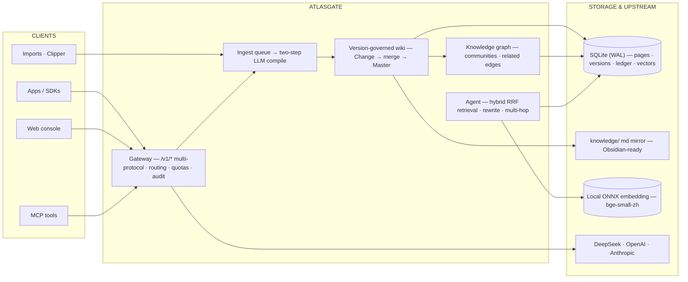

# AtlasGate

**Local LLM infrastructure for small engineering teams**: a multi-protocol OpenAI/Anthropic API gateway, a version-governed **LLM Wiki** (Karpathy methodology), a knowledge graph, and an evidence-first knowledge agent.

[简体中文](README.zh-CN.md) · [English](README.en-US.md) · [中文文档导航](docs/zh-CN/README.md) · [English docs](docs/en-US/README.md)

---

## Overview

Most RAG systems answer by re-reading raw documents on every query, so **knowledge never accumulates**. AtlasGate follows Karpathy's [LLM Wiki](https://gist.github.com/karpathy/442a6bf555914893e9891c11519de94f) methodology instead: an LLM **compiles** ingested sources into a continuously maintained wiki — entities, concepts, source summaries, and system pages (`index.md` / `log.md` / `overview.md`) — governed by a versioned Change → merge → immutable-Master audit chain. The knowledge agent then retrieves from that compiled wiki with citations, offline-first, zero npm runtime dependencies.

> The design is informed by [Karpathy's LLM Wiki](https://gist.github.com/karpathy/442a6bf555914893e9891c11519de94f), [`llm-wiki-skill`](https://github.com/sdyckjq-lab/llm-wiki-skill), and [`llm_wiki`](https://github.com/nashsu/llm_wiki); the implementation is independent.


## What it does

| Component | Highlights |
| --- | --- |
| **Multi-protocol gateway** | Chat Completions, Responses, Anthropic Messages, Embeddings, SSE, model listing, token counting |
| **Smart routing** | Vision-capability filtering, quality/cost/latency/reliability scoring, credential pools, cooldowns, bounded failover, per-attempt audit evidence |
| **Usage governance** | Client-key scopes, model allowlists, RPM/TPM limits, token quotas, monthly budgets, revocation, retained audit history, upstream balance view |
| **LLM Wiki compiler** | Two-step analysis → generation, persistent ingest queue, SHA256 dedup, per-KB `review`/`auto` ingest modes, batch review, Lint, source traceability |
| **Version governance** | Multi-user Changes, optimistic concurrency, conflict ledger, tombstones, versioned documents and graph |
| **Knowledge graph** | Pure-JS ForceAtlas2 layout, Louvain communities, 5-signal related edges, search/drag/hover/minimap |
| **Knowledge agent** | Hybrid retrieval — lexical bigram + local dense page vectors fused by **RRF**, graph-degree pseudo-rerank, zero-evidence query rewriting, wikilink **multi-hop** expansion, evidence-sufficiency discipline, `save_to_wiki` |
| **Console & disk** | Build-free 8-view web console, Obsidian-ready `knowledge/` md mirror, ZIP export, MCP |



## Quick start

Requirements: **Node.js 24+** and **Python 3.11+** (auto-detects `python` / `python3`). No npm dependencies.

```bash
npm start
```

Open **http://127.0.0.1:4310** — console defaults `admin / atlasgate-admin`; gateway key `atlasgate-dev-key`.

```bash
curl http://127.0.0.1:4310/v1/chat/completions \
  -H "Authorization: Bearer atlasgate-dev-key" -H 'Content-Type: application/json' \
  -d '{"model":"auto","messages":[{"role":"user","content":"ping"}]}'
```

> The built-in `atlas-mini` provider validates the full local path with no real upstream. Configure an OpenAI-compatible Provider (e.g. DeepSeek) to enable real routing and LLM compilation. Dense retrieval works fully offline with a local ONNX embedding service (`python/atlasgate_agent/embedding_worker.py`).

## Documentation

- **中文文档导航** — [docs/zh-CN/README.md](docs/zh-CN/README.md) · [从零复现](docs/zh-CN/GETTING_STARTED.md) · [项目介绍](docs/zh-CN/INTRODUCTION.md)
- **English docs** — [docs/en-US/README.md](docs/en-US/README.md) · [Getting started](docs/en-US/GETTING_STARTED.md)
- Feature tracking — [guides/FEATURE_MATRIX.md](docs/zh-CN/guides/FEATURE_MATRIX.md) · Architecture decisions (ADR-001~014) — [DECISIONS.md](docs/zh-CN/DECISIONS.md)
- RAG retrieval upgrade plan — [RAG_PLAN.md](docs/zh-CN/RAG_PLAN.md)

## Storage & boundaries

Knowledge pages are versioned in SQLite at `data/atlasgate.db`. `knowledge/<kb>/` is a read-only Markdown mirror generated after publication; ZIP export is available from the console.

AtlasGate is a single-node modular monolith. The console targets loopback / trusted private networks; public deployment needs an authenticated admin plane, TLS, egress controls, and application-level secret protection (see [SECURITY.md](docs/zh-CN/SECURITY.md)). Provider credentials are not encrypted at the application layer.

## Tests

```bash
npm test          # Node + Python suites
npm run check     # syntax + gate
```

See [TEST_PLAN.md](docs/zh-CN/TEST_PLAN.md) / [TEST_REPORT.md](docs/zh-CN/TEST_REPORT.md). Current: **Node 84 · Python 19**.

## License

[MIT](LICENSE)
