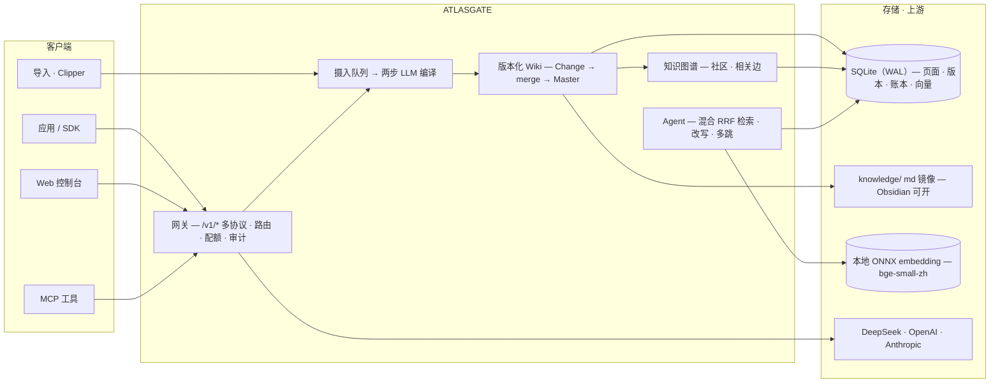

# AtlasGate

**面向小型研发团队的本地 LLM 基础设施**：OpenAI / Anthropic 多协议 API 网关 + 具备协作版本治理、LLM 自动编译与关系图谱的知识库（LLM Wiki）+ 默认引用证据的知识 Agent。

[中文文档导航](docs/zh-CN/README.md) · [项目介绍](docs/zh-CN/INTRODUCTION.md)

---

## 项目介绍

传统 RAG 每次查询都从原始文档现取现答，**知识不会积累**。AtlasGate 遵循 Karpathy 的 [LLM Wiki](https://gist.github.com/karpathy/442a6bf555914893e9891c11519de94f) 方法论：LLM 把摄入的素材**编译**成持续维护的 Wiki——实体页、概念页、素材摘要页，以及 `index.md` / `log.md` / `overview.md` 系统页——全部经由版本化审计链（Change → merge → 不可变 Master）治理。知识 Agent 从这份编译后的知识库检索并带引用回答，**离线优先、零 npm 运行依赖**。

> 设计参考 [Karpathy's LLM Wiki](https://gist.github.com/karpathy/442a6bf555914893e9891c11519de94f)、[`llm-wiki-skill`](https://github.com/sdyckjq-lab/llm-wiki-skill)、[`llm_wiki`](https://github.com/nashsu/llm_wiki)；实现为独立设计。


## 核心能力

| 组件 | 亮点 |
| --- | --- |
| **多协议网关** | Chat Completions · Responses · Anthropic Messages · Embeddings · SSE · 模型列表 · Token 计数 |
| **智能路由** | 视觉能力过滤、质量/成本/延迟/可靠性评分、凭据池、冷却与有界 Failover、每次 attempt 留痕 |
| **用量治理** | 客户端密钥 scope · 模型白名单 · RPM/TPM · Token 配额 · 月预算 · 撤销 · 审计保留 · 上游余额展示 |
| **LLM Wiki 编译** | 两步编译（分析→生成）、持久化摄入队列、SHA256 去重、per-KB `review`/`auto` 模式、批次审阅、Lint、溯源 |
| **版本治理** | 多用户 Change、乐观并发、冲突账本、tombstone、版本化文档与图谱 |
| **知识图谱** | 纯 JS ForceAtlas2 布局、Louvain 社区、5 信号相关边、搜索/拖拽/悬停/小地图 |
| **知识 Agent** | 混合检索——词法 bigram + 本地稠密页面向量 **RRF** 融合、图谱度数伪重排、零证据查询改写、wikilink **多跳**扩展、证据充分性约束、`save_to_wiki` |
| **控制台与磁盘** | 免构建 8 视图 Web 控制台、Obsidian 可打开的 `knowledge/` md 镜像、ZIP 导出、MCP |



## 快速开始

要求：**Node.js 24+** 与 **Python 3.11+**（自动探测 `python`/`python3`，无 npm 依赖）。

```bash
npm start
```

打开 **http://127.0.0.1:4310** —— 控制台默认 `admin / atlasgate-admin`；网关 Key `atlasgate-dev-key`。

```bash
curl http://127.0.0.1:4310/v1/chat/completions \
  -H "Authorization: Bearer atlasgate-dev-key" -H 'Content-Type: application/json' \
  -d '{"model":"auto","messages":[{"role":"user","content":"ping"}]}'
```

> 内置 `atlas-mini` mock 可离线验证全链路；配置 OpenAI 兼容 Provider（如 DeepSeek）后启用真实路由与 LLM 编译。稠密检索可完全离线（本地 ONNX embedding 服务 `python/atlasgate_agent/embedding_worker.py`）。

## 文档

- [中文文档导航](docs/zh-CN/README.md) · [从零复现](docs/zh-CN/GETTING_STARTED.md) · [项目介绍](docs/zh-CN/INTRODUCTION.md) · [RAG 升级计划](docs/zh-CN/RAG_PLAN.md)
- 功能追踪 — [guides/FEATURE_MATRIX.md](docs/zh-CN/guides/FEATURE_MATRIX.md) · 架构决策（ADR-001~014）— [DECISIONS.md](docs/zh-CN/DECISIONS.md)

## 存储与边界

知识页面版本化存储在 SQLite（`data/atlasgate.db`）；`knowledge/<库>/` 是发布后生成的只读 Markdown 镜像；控制台可导出 ZIP。

单机模块化单体；控制台面向回环/可信私网——公网部署需认证管理面、TLS、出网管控与应用层密钥保护（见 [SECURITY.md](docs/zh-CN/SECURITY.md)）；Provider 凭据未做应用层加密。

## 测试

```bash
npm test          # Node + Python 全量
npm run check     # 语法 + 门禁
```

见 [TEST_PLAN.md](docs/zh-CN/TEST_PLAN.md) / [TEST_REPORT.md](docs/zh-CN/TEST_REPORT.md)。当前：**Node 84 · Python 19**。

## 许可证

[MIT](LICENSE)
