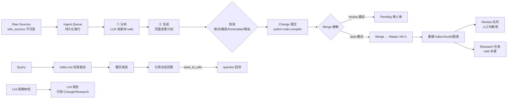

# AtlasGate LLM Wiki 知识库架构重构实施文档

> 版本：v1.0（评审稿）　适用范围：AtlasGate 0.4
> 本文档只做改造方案与实施步骤，**不包含任何代码改动**；评审通过后再按 Phase 逐项实施。
> 文档中所有 `⚠️ 决策点` 都需要你在评审时拍板，汇总见 [第 11 节决策清单](#11-决策清单与评审检查单)。

---

## 目录

1. [文档目的与依据](#1-文档目的与依据)
2. [现状盘点（As-Is）](#2-现状盘点as-is)
3. [目标架构（To-Be）：Karpathy LLM Wiki 三层模型](#3-目标架构to-bekarpathy-llm-wiki-三层模型)
4. [差距分析（Gap）](#4-差距分析gap)
5. [总体改造策略与不改造范围](#5-总体改造策略与不改造范围)
6. [数据模型设计](#6-数据模型设计)
7. [LLM Wiki 编译管线（核心）](#7-llm-wiki-编译管线核心)
8. [Lint 与维护操作](#8-lint-与维护操作)
9. [查询回存（Query → Wiki）](#9-查询回存query--wiki)
10. [图谱增强与浏览体验](#10-图谱增强与浏览体验)
11. [决策清单与评审检查单](#11-决策清单与评审检查单)
12. [分阶段实施计划（含验收标准与测试）](#12-分阶段实施计划含验收标准与测试)
13. [风险与回滚](#13-风险与回滚)
14. [参考材料摘要](#14-参考材料摘要)

---

## 1. 文档目的与依据

### 1.1 目的

AtlasGate 0.4 已经具备「LLM Wiki 风格」的**数据模型与治理语义**（Markdown 页面、`[[WikiLink]]`、版本化发布、关系图、混合检索、证据 Agent），但**缺少 LLM Wiki 方法论最核心的部分——LLM 作为知识库的"编译器与维护者"持续编译、交叉引用、更新与体检知识库**。当前的知识 Agent 只能"回答"（Query），不会"消化"（Ingest）也不会"体检"（Lint）；导入文档只是把原文原样存成页面，没有任何 LLM 参与的编译动作。

本文档的目标是：把 AtlasGate 从「存储原始内容的版本化知识库」重构为「**LLM 增量编译并持续维护的 Wiki 知识库**」，同时**完整保留现有的版本治理、审计与网关能力**（这是 AtlasGate 相对两个参考项目的差异化优势）。

### 1.2 输入材料

| 材料 | 用途 |
| --- | --- |
| [Karpathy: LLM Wiki（gist）](https://gist.github.com/karpathy/442a6bf555914893e9891c11519de94f) | 方法论本源：三层架构、Ingest/Query/Lint 三操作、index.md/log.md、schema 配置 |
| [sdyckjq-lab/llm-wiki-skill](https://github.com/sdyckjq-lab/llm-wiki-skill) | 目录分类法（raw/ + wiki/）、置信度标注、缓存去重、两步式整理、离线知识图谱 |
| [nashsu/llm_wiki](https://github.com/nashsu/llm_wiki) | 桌面化实现：两步链式 Ingest、purpose.md、4 信号相关度图谱、Louvain 社区、异步 Review、Deep Research、持久化摄入队列 |
| 本项目源码（`src/`、`python/`、`web/`、`docs/`） | 改造对象与现状基线 |

> 参考材料原文已缓存在仓库 `.research/` 目录（karpathy-gist.md、skill-readme.md、wiki-readme.md），实施时可直接引用；评审通过后可删除该目录。

---

## 2. 现状盘点（As-Is）

### 2.1 当前架构概览

```text
Client / Agent / MCP ──> 协议 + 鉴权 ──> 配额/风险策略 ──> 能力过滤 + 评分路由 ──> OpenAI/Anthropic Provider
                                                          └──> Python 知识 Agent（只读查询）
                                                                   ├── 检索 Master chunk（BM25 + feature vector / Qdrant）
                                                                   ├── 证据拼装 + 引用回答
                                                                   └── Skills / Memory（use_memory 显式开启）
知识管理：导入(MD/TXT/PDF) ──> Change ──> 批量/到期 Merge ──> 不可变 Master vN ──> 重建 chunk + 关系图
```

关键文件：

| 文件 | 职责 |
| --- | --- |
| `src/db.js` | SQLite schema（`knowledge_*` 系列表）与迁移 |
| `src/services/knowledge.js` | 知识库 CRUD、Change 修订、Merge 发布、分段、图谱、混合检索 |
| `src/services/agent.js` | Skills/Memory 生命周期、Agent 编排、run 审计 |
| `src/services/semantic-index.js` | 可选 Qdrant 语义索引 |
| `python/atlasgate_agent/engine.py` | Python Agent Core：检索、Memory、Skills、prompt 拼装、抽取式 fallback |
| `src/services/mcp.js` | 7 个 MCP 工具（search/ask/graph/submit_change/merge/memory/skill） |
| `web/app.js` | 无构建依赖控制台（7 个视图，知识区 6 个 tab） |

### 2.2 已具备的 LLM Wiki 要素（保留不动）

- ✅ Markdown 页面模型：文件路径 = 页面 ID，标题层级 = `heading_path`
- ✅ `[[WikiLink]]` / 相对链接 / frontmatter 标签 → 版本化关系图
- ✅ 变更 → 合并 → 不可变 Master 的版本治理（多用户乐观并发、冲突账本、tombstone）
- ✅ 标题/段落感知分段器（chunk 带 `chunk_index` / `heading_path` / `char_count`）
- ✅ 混合检索（中文 bigram / 英文 token BM25 + feature vector，可选 Qdrant）
- ✅ 证据引用式知识 Agent（`validate -> retrieve -> memory -> skills -> prompt -> route -> cite -> ledger`）
- ✅ Skills / Memory / MCP 工具 / 导入账本

### 2.3 核心缺口（一句话总结）

> **LLM 不维护知识库。** 导入 = 原文存档；查询 = 现取现答；没有 schema 约束、没有 index/log 目录页、没有原始素材层、没有两步编译、没有体检、没有查询回存、没有人工评审队列。知识不会"越用越厚"。

---

## 3. 目标架构（To-Be）：Karpathy LLM Wiki 三层模型

### 3.1 三层架构

```text
┌─────────────────────────────────────────────────────────────────┐
│ Layer 1  Raw Sources（原始素材，不可变）                           │
│   raw/articles/  raw/pdfs/  raw/notes/  raw/assets/  ...          │
│   LLM 只读，永不修改；这是事实来源（source of truth）              │
├─────────────────────────────────────────────────────────────────┤
│ Layer 2  The Wiki（LLM 生成并维护的 Markdown 页面）                │
│   entities/  concepts/  sources/  comparisons/  synthesis/        │
│   queries/   overview.md  index.md  log.md  purpose.md  schema.md │
│   人读，LLM 写；每次 ingest/query/lint 都持续增量更新               │
├─────────────────────────────────────────────────────────────────┤
│ Layer 3  The Schema（wiki 公约，随使用共同进化）                    │
│   schema.md：页面类型、目录约定、frontmatter 规范、链接规范、        │
│   ingest/query/lint 工作流说明、语言要求                            │
│   purpose.md：为什么存在这个 wiki、关键问题、研究范围、演进论点       │
└─────────────────────────────────────────────────────────────────┘
```

### 3.2 页面分类法（Page Taxonomy）

| 目录 | 页面类型 `type` | 说明 |
| --- | --- | --- |
| `entities/` | `entity` | 人物、组织、产品、工具等实体页 |
| `concepts/` | `concept` | 理论、方法、技术等概念页 |
| `sources/` | `source` | 每个原始素材的摘要页（含 `sources[]` 溯源） |
| `comparisons/` | `comparison` | 对比分析 |
| `synthesis/` | `synthesis` | 跨素材综合分析（含 `sessions/` 对话结晶） |
| `queries/` | `query` | 保存的优质问答结果 |
| 根目录 | `overview` / `index` / `log` / `purpose` / `schema` / `note` | 系统页与自由笔记 |

### 3.3 三大操作闭环

```text
Ingest（两步式）                     Query（可回存）                    Lint（周期性）
  素材 ──> ①分析 ──> ②生成 ──>        提问 ──> 检索页面 ──> 合成回答       读 index + 页面
  新页面/更新实体/更新 index/log       ──> 有价值? ──> 存 queries/ ──>     ──> 矛盾/过时/孤立页/
  ──> Change ──> Merge ──> Master     （可选自动提炼实体进 wiki）          缺页/缺链接/数据缺口
                                                                         ──> 报告 ──> 可转 Change 或研究
```

### 3.4 与现有版本治理的结合方式（关键设计）

**不变**：Change → merge → 不可变 Master 的发布链路、冲突账本、审计。

**变化**：

1. 新增 **Raw Sources 层**：`wiki_sources` 表保存不可变原始素材，与 wiki 页面（`knowledge_documents`）分离。导入 ≠ 直接成为页面；导入 = 进入素材层，再由编译管线产出页面。
2. **页面元数据增强**：`knowledge_documents` 增加 `page_type` / `frontmatter_json` / `confidence` / `sources_json`，随版本天然继承版本化与审计。
3. **LLM 生成的页面内容也走 Change**：编译管线产出的每个页面变更以 `author=wiki-compiler` 提交为 Change，`ingest_mode=review` 时留在 pending 等人审，`ingest_mode=auto` 时自动 merge（个人模式）。**LLM 永远没有绕过审计链直接写库的路径。**
4. **index.md / log.md / overview.md / purpose.md / schema.md 作为真实 wiki 页面**（保留路径，如 `index.md`、`purpose.md`），由编译管线维护，随版本发布。`wiki_log` 表是 log.md 的持久化镜像，便于结构化查询。
5. **检索双通道**：Query 时先读 `index.md`（目录驱动找页面）→ 整页阅读；chunk 级 BM25/Qdrant 保留为"页面内定位"工具。默认打开 `page_level` 检索。

### 3.5 目标架构总览图



---

## 4. 差距分析（Gap）

| # | Karpathy / 参考项目要素 | AtlasGate 现状 | 缺口 | 改造范围 | 优先级 |
| --- | --- | --- | --- | --- | --- |
| G1 | **Schema 层**（wiki 公约配置文件） | 无；只有 Skills（回答时的指令），不是"维护 wiki 的公约" | 每个知识库缺 `schema.md`（页面类型/目录/frontmatter/链接/工作流约定） | 数据模型 + 编译管线 + 控制台 | P0 |
| G2 | **purpose.md**（方向意图） | 无 | 缺知识库目标/关键问题/研究范围 | 数据模型 + 控制台 | P0 |
| G3 | **Raw Sources 与 Wiki 分层** | 导入即页面，无独立素材层 | 缺不可变素材层与 `sources[]` 溯源 | 数据模型 + 导入改造 | P0 |
| G4 | **两步式 Ingest（分析→生成）** | 导入 = 原文存档，LLM 不参与 | 缺 LLM 编译管线：素材摘要、实体/概念页、交叉引用、index/log 更新 | 编译管线（Python + Node） | P0 |
| G5 | **index.md / log.md** | 无（只有版本表） | 缺目录页与时间线日志页，LLM 导航入口缺失 | 编译管线 + 数据模型 | P0 |
| G6 | **查询回存（Query → Wiki）** | 回答后只进 `agent_runs` 审计 | 有价值的回答无法沉淀为 `queries/` 页面并提炼实体 | Agent 改造 | P1 |
| G7 | **Lint 体检** | 无 | 缺矛盾/过时/孤立页/缺页/断链/数据缺口检查 | 编译管线 + 报告表 | P1 |
| G8 | **置信度标注** | 无 | 缺 EXTRACTED/INFERRED/AMBIGUOUS/UNVERIFIED | frontmatter 规范 + 生成管线 + UI | P1 |
| G9 | **摄入去重缓存**（SHA256） | `content_hash` 只用于版本比对 | 缺"素材未变则跳过"的 token 节省 | 数据模型 + 编译管线 | P1 |
| G10 | **异步 Review 队列（HITL）** | 无 | 缺"LLM 标记需人判断项"的异步队列与动作约束 | 数据模型 + 编译管线 + 控制台 | P1 |
| G11 | **持久化摄入队列** | 导入同步执行，单文件 | 缺串行队列、崩溃恢复、重试、进度可视化 | 数据模型 + 编译管线 + 控制台 | P1 |
| G12 | **图谱相关度模型** | 图只表达结构（document/heading/tag/link） | 缺 4 信号权重（直接链接×3、素材重叠×4、Adamic-Adar×1.5、类型亲和×1.0） | `rebuildGraph` 改造 | P2 |
| G13 | **Louvain 社区发现 + 图谱洞察** | 无 | 缺自动聚类、凝聚度评分、孤立页/稀疏社区/桥接节点洞察 | 图谱改造 + 控制台 | P2 |
| G14 | **Wiki 阅读/编辑体验** | 控制台只有文档列表 + 文本编辑 | 缺 Obsidian 式三栏阅读（wiki 树/内容/图谱）、frontmatter 徽标、置信度标识 | 控制台 | P2 |
| G15 | **Obsidian / git 兼容导出** | wiki 只存 SQLite | 缺 Markdown 目录导出（Obsidian vault 布局） | 导出服务 | P3 |
| G16 | **URL / Web Clipper 摄入** | 仅 MD/TXT/PDF 上传 | 缺 URL 抓取、浏览器剪藏 | 摄入适配器（可选） | P3 |
| G17 | **Deep Research** | 无 | 缺多查询 web 搜索（Tavily/SerpApi/SearXNG）与结果自动入库 | Research 任务 | P3 |
| G18 | **多格式解析**（DOCX/XLSX/EPUB） | 仅 PDF | 缺 Office/电子书解析 | 可选 Python 适配器 | P3 |
| G19 | **对话结晶** | Memory 只存摘要，不沉淀为知识 | 缺把对话直接变成 wiki 页面 | Agent 改造 | P3 |

---

## 5. 总体改造策略与不改造范围

### 5.1 改造策略

1. **增量而非推倒**：保持 Node + SQLite + Python worker pool 的技术栈与模块化单体形态；不引入 Web 框架和 npm 运行依赖（除非你拍板 D4）。
2. **契约先行**：先定 frontmatter 规范、页面分类法、两步分析 JSON 契约，再写实现。
3. **LLM 写入永远走审计链**：编译管线只产生 Change，不直接写 Master。
4. **分阶段交付**：P0 数据契约 → P0 编译管线 → P1 维护/回存 → P2 图谱/体验 → P3 生态扩展；每阶段可独立验收、可回滚。
5. **兼容旧数据**：存量知识库自动迁移（见 §6.5），旧 API 不破坏。

### 5.2 不改造范围（保持现状）

- 协议网关、鉴权、配额/风险策略、凭据池、Failover、用量账本（`gateway.js` / `auth.js` / `protocol.js` / `sse.js`）
- Change → merge → Master 版本治理内核与冲突账本
- Python worker pool 基础设施、Memory/Skills 生命周期
- 控制台整体布局与登录体系

---

## 6. 数据模型设计

### 6.1 新表（`src/db.js` SCHEMA 追加）

```sql
-- G3: 原始素材层（不可变，LLM 只读）
CREATE TABLE IF NOT EXISTS wiki_sources (
  id TEXT PRIMARY KEY,
  kb_id TEXT NOT NULL REFERENCES knowledge_bases(id) ON DELETE CASCADE,
  path TEXT NOT NULL,                    -- raw/articles/xxx.md
  filename TEXT NOT NULL,
  media_type TEXT NOT NULL DEFAULT 'text/markdown',
  content TEXT NOT NULL,
  content_hash TEXT NOT NULL,
  size_bytes INTEGER NOT NULL DEFAULT 0,
  status TEXT NOT NULL DEFAULT 'queued', -- queued|ingesting|ingested|failed|skipped
  error TEXT,
  created_at TEXT NOT NULL,
  ingested_at TEXT,
  UNIQUE(kb_id, content_hash)
);

-- G11: 持久化摄入队列（串行、崩溃恢复、重试）
CREATE TABLE IF NOT EXISTS ingest_queue (
  id TEXT PRIMARY KEY,
  kb_id TEXT NOT NULL REFERENCES knowledge_bases(id) ON DELETE CASCADE,
  source_id TEXT REFERENCES wiki_sources(id) ON DELETE SET NULL,
  kind TEXT NOT NULL DEFAULT 'document', -- document|url|paste|folder|query_answer
  payload_json TEXT NOT NULL DEFAULT '{}',
  status TEXT NOT NULL DEFAULT 'pending',-- pending|running|done|failed|cancelled
  attempt INTEGER NOT NULL DEFAULT 0,
  error TEXT,
  created_at TEXT NOT NULL,
  started_at TEXT, completed_at TEXT
);

-- G9: SHA256 摄入去重缓存
CREATE TABLE IF NOT EXISTS ingest_cache (
  kb_id TEXT NOT NULL REFERENCES knowledge_bases(id) ON DELETE CASCADE,
  source_hash TEXT NOT NULL,
  source_id TEXT NOT NULL,
  wiki_version INTEGER,
  status TEXT NOT NULL DEFAULT 'ingested',
  created_at TEXT NOT NULL,
  PRIMARY KEY(kb_id, source_hash)
);

-- G10: 异步人工评审队列（HITL）
CREATE TABLE IF NOT EXISTS review_items (
  id TEXT PRIMARY KEY,
  kb_id TEXT NOT NULL REFERENCES knowledge_bases(id) ON DELETE CASCADE,
  source_id TEXT REFERENCES wiki_sources(id) ON DELETE SET NULL,
  kind TEXT NOT NULL,                    -- create_page|deep_research|verify|skip
  payload_json TEXT NOT NULL DEFAULT '{}',
  suggested_action TEXT NOT NULL DEFAULT '',
  status TEXT NOT NULL DEFAULT 'open',   -- open|resolved|dismissed
  action TEXT NOT NULL DEFAULT '',
  created_at TEXT NOT NULL,
  resolved_at TEXT
);

-- G7: Lint 报告
CREATE TABLE IF NOT EXISTS lint_reports (
  id TEXT PRIMARY KEY,
  kb_id TEXT NOT NULL REFERENCES knowledge_bases(id) ON DELETE CASCADE,
  version INTEGER NOT NULL,
  kind TEXT NOT NULL,      -- contradiction|stale_claim|orphan_page|missing_page|missing_link|data_gap
  path_a TEXT, path_b TEXT,
  detail TEXT NOT NULL DEFAULT '',
  severity TEXT NOT NULL DEFAULT 'info', -- info|warn|error
  status TEXT NOT NULL DEFAULT 'open',   -- open|acked|fixed|dismissed
  resolution TEXT NOT NULL DEFAULT '',
  created_at TEXT NOT NULL,
  resolved_at TEXT
);

-- G17: Deep Research 任务
CREATE TABLE IF NOT EXISTS research_jobs (
  id TEXT PRIMARY KEY,
  kb_id TEXT NOT NULL REFERENCES knowledge_bases(id) ON DELETE CASCADE,
  topic TEXT NOT NULL,
  queries_json TEXT NOT NULL DEFAULT '[]',
  provider TEXT NOT NULL DEFAULT '',
  status TEXT NOT NULL DEFAULT 'pending',-- pending|running|done|failed
  result_page TEXT,
  error TEXT,
  created_at TEXT NOT NULL,
  completed_at TEXT
);

-- G5: wiki 事件日志（log.md 的持久化镜像）
CREATE TABLE IF NOT EXISTS wiki_log (
  id TEXT PRIMARY KEY,
  kb_id TEXT NOT NULL REFERENCES knowledge_bases(id) ON DELETE CASCADE,
  version INTEGER,
  kind TEXT NOT NULL,       -- ingest|query|lint|merge|review|export
  detail TEXT NOT NULL DEFAULT '',
  created_at TEXT NOT NULL
);
```

### 6.2 现有表迁移（`migrateSchema` 追加列）

```sql
-- knowledge_documents：页面元数据（随版本天然继承）
ALTER TABLE knowledge_documents ADD COLUMN page_type TEXT NOT NULL DEFAULT 'wiki';
ALTER TABLE knowledge_documents ADD COLUMN title TEXT;
ALTER TABLE knowledge_documents ADD COLUMN frontmatter_json TEXT NOT NULL DEFAULT '{}';
ALTER TABLE knowledge_documents ADD COLUMN confidence TEXT NOT NULL DEFAULT 'INFERRED';
ALTER TABLE knowledge_documents ADD COLUMN sources_json TEXT NOT NULL DEFAULT '[]';

-- knowledge_bases：wiki 公约与摄入策略
ALTER TABLE knowledge_bases ADD COLUMN schema_md TEXT NOT NULL DEFAULT '';
ALTER TABLE knowledge_bases ADD COLUMN purpose_md TEXT NOT NULL DEFAULT '';
ALTER TABLE knowledge_bases ADD COLUMN ingest_mode TEXT NOT NULL DEFAULT 'review'; -- review|auto
```

### 6.3 frontmatter 规范（每页必带）

```markdown
---
type: entity            # entity|concept|source|comparison|synthesis|query|overview|index|log|purpose|schema|note
title: "OpenAI o3"
sources: ["raw/articles/openai-o3.md"]
confidence: EXTRACTED   # EXTRACTED|INFERRED|AMBIGUOUS|UNVERIFIED
tags: [llm, model]
created: 2026-04-01T00:00:00Z
updated: 2026-04-02T00:00:00Z
---
正文……
```

实现位置：新增 `src/core/frontmatter.js`（JS，YAML 子集解析/序列化）与 `python/atlasgate_agent/frontmatter.py`（Python 侧一致实现），供分段、图谱、编译管线、检索共用。现有 `extractTags` 对 frontmatter 的临时处理迁移到该模块。

### 6.4 系统页面约定（保留路径）

| 页面路径 | 类型 | 维护者 | 说明 |
| --- | --- | --- | --- |
| `purpose.md` | purpose | 人 + LLM 共同 | 方向意图；每次 ingest/query 时 LLM 读取 |
| `schema.md` | schema | 人 + LLM 共同 | wiki 公约；编译管线遵守 |
| `index.md` | index | LLM（每次 ingest 更新） | 内容目录：每页链接 + 一行摘要 + 分类 |
| `log.md` | log | LLM（每次操作追加） | 时间线：`## [YYYY-MM-DD] ingest \| 标题`（可被 grep/解析） |
| `overview.md` | overview | LLM（每次 ingest 更新） | 全局综述，自动再生成 |
| `queries/`、`sources/`、`entities/`、`concepts/`、`comparisons/`、`synthesis/` | 业务页 | LLM | 页面分类目录 |

`createKnowledgeBase` 时用模板初始化 purpose.md/schema.md/index.md/log.md/overview.md（作为首批页面 v1 发布）。

### 6.5 存量数据迁移

- 迁移标记（`system_metadata`）：`wiki_model_v1`
- 存量 `knowledge_documents`：按路径推断 `page_type`（`entities/`→entity、`concepts/`→concept、`sources/`→source，其余→note/wiki），`sources_json` 置空，`frontmatter_json` 从正文头部解析（无则空）
- 存量 `knowledge_bases`：`schema_md`/`purpose_md` 用默认模板填充；若缺系统页则创建为 pending Change，由用户确认后 merge
- 迁移幂等、可重复执行；迁移前自动备份 DB 文件

---

## 7. LLM Wiki 编译管线（核心）

### 7.1 新服务与文件

| 文件 | 职责 |
| --- | --- |
| `src/services/wiki-compiler.js`（新） | 编排：入队、worker 循环、两步调用、页面校验、Change 提交、merge 决策、review/research 生成、log 追加 |
| `src/services/ingest-queue.js`（新） | 持久化队列：入队/取队/重试/取消/崩溃恢复；串行执行 |
| `python/atlasgate_agent/ingest.py`（新） | ①分析 prompt + JSON 契约校验；②生成 prompt + 页面变更输出 |
| `python/atlasgate_agent/lint.py`（新） | Lint prompt + 问题契约 |
| `src/core/frontmatter.js` / `python/atlasgate_agent/frontmatter.py`（新） | frontmatter 解析/序列化 |

### 7.2 摄入流程（单素材）

```text
1. 入队        POST /api/knowledge-bases/:id/ingest（document|url|paste|folder）
2. 去重        sha256(内容) → ingest_cache 命中 → 标记 skipped，结束
3. 存档        写入 wiki_sources（不可变素材层）
4. ①分析       调用 python prepare_ingest_analysis：
              输入：素材全文 + index.md + 相关页面摘要 + purpose.md
              输出：结构化分析 JSON（见 7.3）
5. ②生成       调用 python prepare_ingest_generation：
              输入：分析 JSON + schema.md
              输出：page_plan 逐页生成完整 Markdown（含 frontmatter）
6. 校验        脚本校验每个页面：路径白名单、frontmatter 必填、confidence 枚举、
              sources[] 存在、无绝对路径、无密钥/手机号（隐私自查，见 §7.5）
7. 提交        submitChange（author=wiki-compiler, base_version=当前 master）
8. 发布         ingest_mode=auto → 批量 merge（摘要 "Wiki ingest: <title>"）
               ingest_mode=review → 留在 pending，控制台提示审阅
9. 衍生        分析中的 review_items → review_items 表；research_queries → research_jobs
10. 记账        更新 ingest_cache；追加 wiki_log 与 log.md；更新 overview.md
11. 重建        merge 后走现有 rebuildIndex/rebuildGraph（图谱含 sources 重叠信号）
```

### 7.3 ①分析阶段 JSON 契约

```json
{
  "key_entities": [
    {"name": "OpenAI", "type": "organization", "summary": "...", "confidence": "EXTRACTED"}
  ],
  "key_concepts": [
    {"name": "reasoning model", "summary": "...", "confidence": "INFERRED"}
  ],
  "arguments": ["..."],
  "connections": [
    {"target": "entities/openai.md", "relation": "related", "note": "..."}
  ],
  "contradictions": [
    {"existing_page": "concepts/reasoning.md", "claim": "...", "new_evidence": "..."}
  ],
  "page_plan": [
    {"action": "create", "path": "sources/openai-o3.md", "type": "source", "title": "...", "rationale": "..."},
    {"action": "update", "path": "entities/openai.md", "type": "entity", "rationale": "补充 o3 信息"},
    {"action": "update", "path": "index.md", "type": "index", "rationale": "登记新页"}
  ],
  "review_items": [
    {"kind": "verify", "payload": {"claim": "...", "source": "..."}, "suggested_action": "人工核实后再写入"}
  ],
  "research_queries": ["OpenAI o3 reasoning benchmark 2026"]
}
```

### 7.4 ②生成阶段契约

- 输入：分析 JSON + schema.md + 需更新的既有页面原文
- 输出：`{ "pages": [ { "path": "...", "content": "完整 Markdown 含 frontmatter" } ] }`
- 校验失败 → 重试一次（带错误信息）；仍失败 → job 标记 failed 并在控制台展示原因

### 7.5 隐私与安全自查

- 分析步骤之前先做**敏感信息自查**：提示 LLM 检查素材中的手机号、邮箱、API Key、私钥，命中则生成 `review_items(kind=verify)` 并默认不写入实体页（对齐 llm-wiki-skill 的 ingest 隐私自查）
- LLM 输出视为**不可信输入**：校验脚本是唯一权威，任何不合规页面丢弃并记入 job error
- 素材内容按现有 `redact()` 规则记账（`agent_runs`/`wiki_log` 不落全文）

### 7.6 队列与并发

- 每知识库串行处理（避免并发 LLM 调用互相踩 pending 基线）；跨知识库可并行
- `attempt <= 3`，失败指数退避；进程重启后扫描 `running` 状态恢复为 `pending`
- 控制台活动面板展示进度（pending/running/done/failed + 取消/重试按钮）

---

## 8. Lint 与维护操作

### 8.1 触发与流程

```text
POST /api/knowledge-bases/:id/lint
  → python prepare_lint：读 index.md + 页面（全文或抽样）+ purpose.md
  → 输出问题列表 JSON
  → 写入 lint_reports（status=open）
  → 控制台 Lint 视图展示；每条可：ack / dismiss / 一键转 Change / 触发 Deep Research
```

### 8.2 问题契约

```json
{
  "issues": [
    {"kind": "contradiction", "path_a": "concepts/a.md", "path_b": "entities/b.md",
     "detail": "A 说 X，B 说非 X", "severity": "warn",
     "suggested_action": "update concepts/a.md"},
    {"kind": "orphan_page", "path_a": "entities/c.md", "detail": "无入链", "severity": "info"},
    {"kind": "missing_page", "path_a": "concepts", "detail": "index 中提及但无页面", "severity": "warn"},
    {"kind": "data_gap", "detail": "可 web 搜索补充", "severity": "info"}
  ]
}
```

### 8.3 结构级检查（无需 LLM，SQL 直算）

- 孤立页：`knowledge_graph_edges` 中无入链的文档节点
- 断链：`[[target]]` 解析后目标不存在的 reference 节点
- index 一致性：`index.md` 列出页面 vs 实际页面差异

---

## 9. 查询回存（Query → Wiki）

### 9.1 能力

`POST /api/agents/knowledge/ask` 增加参数：

```json
{ "save_to_wiki": true, "page_type": "query", "title": "o3 vs o4 对比" }
```

流程：

```text
回答生成 → 若 save_to_wiki=true：
  1. 答案 + 引用页面清单 → python 生成 queries/<slug>.md（frontmatter: type=query, sources[]=引用页面）
  2. submitChange（author=wiki-compiler）→ 按 ingest_mode 决定是否自动 merge
  3. 追加 wiki_log + log.md
  4. 可选：把新页面作为素材走一遍轻量 ingest，提炼实体/概念进入图谱
```

### 9.2 对话结晶（G19，P3 可选）

把整段有价值对话（问题链 + 结论）沉淀为 `synthesis/sessions/<slug>.md`，与查询回存共用 `save_to_wiki` 机制，只是 `page_type` 不同。

---

## 10. 图谱增强与浏览体验

### 10.1 相关度模型（G12）

`rebuildGraph` 的边权重升级为 4 信号：

| 信号 | 权重 | 来源 |
| --- | --- | --- |
| 直接链接（`[[wikilink]]` / 相对链接） | ×3.0 | 现有 `links_to` 边 |
| 素材重叠（同 `sources[]`） | ×4.0 | 新：`sources_json` 求交 |
| Adamic-Adar（共享邻居，按邻居度加权） | ×1.5 | 图后处理 |
| 类型亲和（同类型页） | ×1.0 | `page_type` |

- 边权重写入 `knowledge_graph_edges.weight`；`graph()` 返回时附带 `signal` 明细
- 兼容旧版本：旧版本图数据按结构边权重 1 保留，不强制重算（懒重建：访问时若全为 weight=1 且存在 `sources_json` 则触发重算）

### 10.2 社区发现与洞察（G13）

- **Louvain 社区**：纯 JS 实现（约 150 行，保持零 npm 依赖原则；若你拍板 D4 引入 sigma/graphology，则用 `graphology-communities-louvain`）
- 凝聚度评分：`实际边数 / 可能边数`，< 0.15 标记为稀疏社区
- 洞察（SQL + 图遍历）：
  - 孤立页（degree ≤ 1）
  - 稀疏社区（cohesion < 0.15 且 ≥ 3 页）
  - 桥接节点（连接 ≥ 3 个社区）
  - 意外连接（跨社区边 / 跨类型边，按 surprise 分数排序）

### 10.3 控制台体验（G14）

- 新增导航「Wiki 知识库」视图：
  - 三栏：wiki 目录树（按 `index.md` + 页面类型）/ 页面阅读（渲染 Markdown + frontmatter 卡片 + 置信度徽标 + `sources[]` 溯源链接）/ 图谱（社区着色 + 权重边 + 洞察面板）
  - 页面编辑：Markdown 文本编辑，保存走 Change（`expected_revision` 保持乐观并发）
- 「知识版本」视图保留并增加：系统页（index/log/purpose/schema/overview）只读预览
- 新增「摄入活动」面板（队列进度）、「Review 队列」视图、「Lint 体检」视图

---

## 11. 决策清单与评审检查单

> ✅ **状态：2026-08-19 经 grilling 压力测试逐轮确认（D1~D10 与 Q1~Q21 全部按推荐），已固化为 ADR-008~010。** 决策状态列 `已确认` 表示评审通过并进入实施契约。

| 编号 | 决策点 | 选项 | 推荐 | 状态 |
| --- | --- | --- | --- | --- |
| D1 | **Wiki 存储形态** | A. DB 为源 + Markdown 导出同步（Obsidian/git 兼容）；B. 改为文件为源、DB 只做索引（推翻现有版本治理） | **A**：保留版本治理优势，导出满足"wiki 是 git 仓库"诉求 | ✅ 已确认 |
| D2 | **Ingest 默认模式** | review（LLM 产物留 pending 等人审）/ auto（自动 merge）/ per-KB 可配 | **per-KB 可配**：个人库 auto，团队库 review | ✅ 已确认（Q4） |
| D3 | **LLM 写入边界** | A. 一律走 Change→merge 审计链；B. 允许 LLM 直写（快但无审计） | **A** | ✅ 已确认（Q3） |
| D4 | **图谱技术** | A. 纯 JS 实现 Louvain（保持零 npm 依赖原则）；B. 引入 sigma.js/graphology | **A**（如需性能或复杂交互再评估 B） | ✅ 已确认（Q5） |
| D5 | **多格式/URL 摄入范围** | 起步仅 MD/TXT/PDF + URL 抓取；DOCX/XLSX/EPUB 后续可选适配器 | 起步 MD/TXT/PDF + 粘贴/URL，其余 P3 可选 | ✅ 已确认（Q16 将 URL 提前到 Phase 1） |
| D6 | **Deep Research 提供商** | Tavily / SerpApi / SearXNG / 暂不启用 | 先不启用，接口预留；P3 按需接入 | ✅ 已确认 |
| D7 | **检索策略** | 默认 index 目录驱动 + 整页阅读，chunk BM25/Qdrant 降级为页面内定位 | 同意 | ✅ 已确认 |
| D8 | **查询回存默认** | `save_to_wiki` 默认关闭，显式开启（防噪音） | 同意 | ✅ 已确认 |
| D9 | **AI 生成内容的默认置信度** | 新页面默认 `INFERRED`，素材摘要默认 `EXTRACTED` | 同意 | ✅ 已确认 |
| D10 | **.research/ 参考目录** | 保留在仓库（便于实施引用）/ 删除 | 保留至实施完成，最后删除 | ✅ 已确认 |

补充确认（grilling Q7~Q21，均已固化进 Phase 契约）：版本噪音复用现有 merge 语义（Q7）；导出为只读 zip 快照、双向同步留后续（Q8）；`batch_id` 分组审阅（Q9）；编译模型走网关 auto、每 KB 可覆盖（Q10）；系统页图谱弱化 + 检索默认排除（Q11，Phase 0 已落地检索排除）；素材覆盖更新 + 级联删除（Q12）；存量迁移自动 + 备份 + 幂等（Q13）；单素材页面 ≤20（Q14）；安全违规丢弃、内容缺陷可人工修复（Q15）；URL 摄入提前到 Phase 1（Q16）；Lint 结构级自动 + LLM 级手动（Q17）；图谱叠加档（Q18）；决策固化为 ADR（Q19）；工作量 17~24 人日为排期基线（Q20）；实施节奏：由 AI 逐 Phase 实施、汇报验收后进入下一 Phase（Q21）。

### 评审检查单

- [x] D1~D10 已确认（grilling 逐轮确认）
- [x] §6 数据模型（新表 + 迁移列）已确认并落地（Phase 0）
- [x] §7 两步分析/生成 JSON 契约已确认（Phase 1 实施时按此实现）
- [x] §12 分阶段范围与验收标准已确认
- [x] 每阶段预计工作量已确认为排期基线
- [x] D2 auto 模式的团队库 review 例外规则已确认（默认 review）

---

## 12. 分阶段实施计划（含验收标准与测试）

> 📌 **实施状态：Phase 0 已完成（2026-08-19）。** 验收：Node 39/39 + Python 7/7 全绿（`ATLASGATE_PYTHON=python3` 下运行；沙箱无 `python` 别名属环境差异，非代码问题）；新增 `test/frontmatter.test.js` 与 `test/wiki-phase0.test.js`；ADR-008~010 已固化；本文档 §11 决策清单已回填。Phase 1（两步编译管线）待验收确认后启动。

### Phase 0 — 数据契约与系统页面（地基，约 2~3 人日）

**目标**：数据模型就绪，存量数据可迁移，系统页模板可创建。

**改动**：

| 文件 | 改动 |
| --- | --- |
| `src/db.js` | 新增 7 张表 + 迁移列 + 迁移标记 `wiki_model_v1` + 存量推断回填 |
| `src/core/frontmatter.js`（新） | frontmatter 解析/序列化 + 单测 |
| `python/atlasgate_agent/frontmatter.py`（新） | 与 JS 行为一致的 frontmatter 实现 + 单测 |
| `src/services/knowledge.js` | `createKnowledgeBase` 支持 schema/purpose 模板与系统页初始化；`getSchema/updateSchema/getPurpose/updatePurpose`；`listPages({page_type})` |
| `src/config.js` | `wikiDefaults`（模板、taxonomy 路径、默认 ingest_mode） |
| `src/app.js` | schema/purpose/pages 路由 |
| `web/app.js` | 知识库设置区：schema/purpose 编辑入口 |
| `docs/ARCHITECTURE.md`、`docs/API.md`、`docs/ROADMAP.md` | 同步更新 |

**验收**：`npm test` 全绿；新建知识库自带 5 个系统页；存量库迁移后页面类型正确、可重复执行；旧 API 全部不破坏。

**测试**：frontmatter 往返；迁移幂等（跑两次）；系统页初始化；`listPages` 过滤。

### Phase 1 — LLM Wiki 编译管线（核心价值，约 5~7 人日）

> 📌 **实施状态：已完成（2026-08-19）。** 验收：Node 47/47 + Python 11/11 全绿；新增 `test/wiki-phase1.test.js`（7 用例，脚本化上游 Provider 模拟两步 LLM）与 `python/tests/test_ingest.py`（4 用例）。实现：`src/services/ingest-queue.js`（持久化队列/崩溃恢复/重试）、`src/services/wiki-compiler.js`（两步编排/校验/审阅/退化路径）、`python/atlasgate_agent/ingest.py`（分析/生成 prompt）、`merge()` 元数据推导、URL 抓取、MCP 3 工具、控制台摄入/Review/批次 UI。已知边界：`ingestConcurrency` 配置预留（当前全局串行）；`research_jobs` 只落库不执行（D6 预留）；合并为全部 pending 一并发布（批次选择性合并留 Phase 2）。

**目标**：两步式 Ingest 全链路跑通（队列 → 分析 → 生成 → 校验 → Change → merge → index/log/overview 更新 → review/research 衍生）。

**改动**：

| 文件 | 改动 |
| --- | --- |
| `python/atlasgate_agent/ingest.py`（新） | 分析/生成 prompt、JSON 契约校验、隐私自查 prompt |
| `python/atlasgate_agent/engine.py` | 导出 `prepare_ingest_analysis` / `prepare_ingest_generation`（或在 ingest.py 实现，engine 透出） |
| `src/services/ingest-queue.js`（新） | 持久化队列 + 崩溃恢复 + 重试 |
| `src/services/wiki-compiler.js`（新） | 编排、页面校验脚本、Change 提交、merge 决策、review/research 落库、log/overview 更新 |
| `src/app.js` | ingest/ingest-queue/sources/reviews/research 路由 |
| `src/services/mcp.js` | 新工具：`wiki_ingest`、`wiki_reviews_list`、`wiki_reviews_resolve`、`wiki_lint_run` |
| `web/app.js` | 摄入表单（粘贴/URL/文件）、活动面板、Review 队列视图 |
| `docs/API.md`、`docs/OPERATIONS.md` | 同步更新 |

**验收**：以一篇长文为素材，auto 模式下：一次 ingest 产生 sources 摘要 + 实体/概念页 + index/log/overview 更新，图含素材重叠边；review 模式下产物全部留 pending；重复 ingest 同一素材被去重跳过；worker 中途 kill 重启后恢复。

**测试**：mock-LLM fixture（固定分析/生成 JSON）跑通全链路；校验脚本拒绝：路径越权、缺 frontmatter、非法 confidence、含密钥文本；队列崩溃恢复；去重命中；review/research 落库。

### Phase 2 — 查询回存 + Lint（约 3~4 人日）

> 📌 **实施状态：已完成（2026-08-19）。** 验收：Node 52/52 + Python 13/13 全绿；新增 `test/wiki-phase2.test.js`（5 用例）与 `python/tests/test_lint.py`（2 用例）。实现：`src/services/lint.js`（结构级 SQL 检查 + LLM 级体检 + 报告生命周期 + 一键建页）、`knowledge.publishHooks`（每次发布自动跑结构级检查，Q17-B）、`python/atlasgate_agent/lint.py`、`saveQueryAnswer`（D8，确定性组装无额外 LLM 调用）、ask 路由与 MCP 的 `save_to_wiki`、控制台 Lint tab 与 Agent 回存开关。已知边界：LLM 级 lint 报告"转 Change"仅对 missing_page 提供一键建 stub 页（矛盾/过时类靠 ack/dismiss + resolution 记录）；批次选择性合并未实现。

**目标**：回答可沉淀为 wiki 页面；周期体检可用；结构级检查可用。

**改动**：

| 文件 | 改动 |
| --- | --- |
| `python/atlasgate_agent/lint.py`（新） | Lint prompt + 契约 |
| `src/services/wiki-compiler.js` | `saveQueryAnswer`、`runLint`、结构级检查（SQL）、lint 转 Change/Research |
| `src/services/agent.js` | `ask` 支持 `save_to_wiki` |
| `src/app.js` | lint / lint-reports / research 路由 |
| `web/app.js` | Lint 视图、查询回存开关 |
| `docs/API.md` | 同步更新 |

**验收**：一次问答 `save_to_wiki=true` 后 `queries/` 出现页面；Lint 报告能识别：孤立页、断链、index 不一致（结构级）+ 矛盾/缺页（LLM 级，mock fixture 验证）；lint 项可 ack/dismiss/一键转 Change。

### Phase 3 — 图谱增强与浏览体验（约 4~5 人日）

> 📌 **实施状态：已完成（2026-08-19）。** 验收：Node 58/58 + Python 13/13 全绿；新增 `test/wiki-phase3.test.js`（6 用例）。实现：`src/core/louvain.js`（纯 JS 确定性 Louvain，递归聚合 + 正确的净增量公式）、`src/core/relevance.js`（4 信号权重）、`src/services/insights.js`（孤立/稀疏/桥接/意外连接）、`rebuildGraph` related 边 + `ensureRelatedEdges` 懒重建、`graph()` 附带 communities/insights/community 标注、控制台「Wiki 知识库」三栏视图（页面树 / Markdown 阅读与编辑走 Change / 社区着色图谱 + 洞察面板）。已知边界：图谱仍为静态环形布局（Q18 叠加档，力导向交互留后续）；AA 信号在页面数 >800 时跳过（性能护栏）。

**目标**：4 信号权重图、Louvain 社区、洞察；控制台 Wiki 三栏阅读/编辑。

**改动**：

| 文件 | 改动 |
| --- | --- |
| `src/services/knowledge.js` | `rebuildGraph` 权重模型（含 sources 重叠边）、懒重建、`graph()` 附带 signal/community |
| `src/core/louvain.js`（新） | 纯 JS Louvain + 凝聚度 |
| `src/services/insights.js`（新） | 孤立页/稀疏社区/桥接节点/意外连接 SQL 与遍历 |
| `web/app.js` | Wiki 视图（三栏）、图谱社区着色、洞察面板、frontmatter/置信度徽标、页面编辑走 Change |
| `docs/ARCHITECTURE.md` | 同步更新 |

**验收**：同素材多页面图谱边权重体现素材重叠；社区划分确定性（同图两次运行一致）；洞察列表正确（手工构造的孤立页/桥节点可检出）；Wiki 视图可阅读/编辑/保存为 Change。

**测试**：权重计算单测；Louvain 确定性；洞察 SQL 用例；懒重建幂等。

### Phase 4 — 生态与扩展（约 3~5 人日，P3 优先级）

> 📌 **实施状态：已完成（2026-08-19）——全部 5 个 Phase 完成。** 验收：Node 63/63 + Python 13/13 全绿；新增 `test/wiki-phase4.test.js`（5 用例）。实现：`src/core/zip.js`（零依赖 store ZIP 写入器 + 测试用读取器）、`src/services/wiki-export.js`（Obsidian 兼容快照，Q8 只读 zip）、`GET .../export` 二进制路由、`GET .../research-jobs`（D6 接口预留）、Wiki 视图「导出 zip」按钮与 Research 任务展示、`docs/WEB_CLIPPER.md` 剪藏说明。按 D5 保持可选的项：Web Clipper 扩展、DOCX/XLSX/EPUB 适配器、Deep Research 执行引擎（接口已预留）；双向目录同步（Q8-B）为后续增强。

**目标**：Obsidian/git 导出、URL/Web Clipper 摄入、多格式可选适配、Deep Research（若 D6 启用）。

**改动**：

| 文件 | 改动 |
| --- | --- |
| `src/services/wiki-export.js`（新） | Master 页面导出为 Markdown 目录（Obsidian vault 布局 + `.obsidian/` 配置 + git 友好），zip 下载 |
| `src/services/source-fetch.js`（新，可选） | URL 抓取（自研轻量 HTML→Markdown 或要求粘贴）；Web Clipper 复用 ingest 队列 |
| `python/document_worker.py` | 可选扩展 DOCX/XLSX/EPUB 适配器 |
| `src/services/research.js`（新，可选） | Tavily/SerpApi/SearXNG 多查询搜索 + 结果合成入 wiki |
| `src/app.js`、`web/app.js` | 对应路由与入口 |
| `README.md`、`docs/DEPLOYMENT.md` | 同步更新 |

**验收**：导出 zip 可用 Obsidian 打开且 wikilink/图谱可用；URL 摄入走完整队列；启用 Deep Research 后研究结果生成 `synthesis/` 页面并自动 ingest。

---

## 13. 风险与回滚

| 风险 | 等级 | 缓解 |
| --- | --- | --- |
| LLM 生成内容质量差/幻觉 | 高 | 校验脚本只信结构；review 模式默认；置信度标注；产物全部可回滚（Change 撤销 / 版本回读） |
| 两步调用 token 成本上升 | 中 | SHA256 去重；index 驱动减少重复读取；仅分析相关页面摘要而非全库 |
| 队列/并发踩 pending 基线 | 中 | 每库串行；`base_version` 统一取提交时刻 master；冲突账本已有语义兜底 |
| 迁移破坏存量数据 | 中 | 迁移前自动备份；迁移幂等；旧 API 不变 |
| 控制台复杂度上升（三栏/多视图） | 低 | 保持无构建依赖的 HTML/JS 结构；组件按视图拆分文件 |
| 图谱计算性能（大库） | 低 | 懒重建 + 版本化缓存；Louvain 限制在节点 ≤ 若干千的规模（超限降级为类型着色） |

**回滚**：每 Phase 独立提交；任一 Phase 验收不通过可整体 revert 该 Phase 的 commits（数据迁移为追加式，回滚仅需删除新表/新列，不影响旧表）。

---

## 14. 参考材料摘要

### 14.1 Karpathy 原文要点

- 核心区别：**知识编译一次并保持最新**，而不是每次查询重新推导；wiki 是持续复利的产物
- 三层：Raw sources（不可变）→ Wiki（LLM 全权维护的 Markdown）→ Schema（公约配置，随使用共同进化）
- 三操作：**Ingest**（一次素材可触及 10~15 个页面）、**Query**（好答案可回存为新页面）、**Lint**（周期性体检：矛盾、过时、孤立页、缺页、断链、数据缺口）
- 两个特殊文件：**index.md**（内容目录，查询时先读它再下钻）、**log.md**（时间线，`## [YYYY-MM-DD] ingest | 标题` 前缀可被 grep 解析）
- "Obsidian 是 IDE，LLM 是程序员，wiki 是代码库"；wiki 本质是 git 仓库的 Markdown 文件

### 14.2 llm-wiki-skill 要点

- 目录分类法：`raw/`（articles/tweets/wechat/xiaohongshu/zhihu/pdfs/notes/assets）与 `wiki/`（entities/topics/sources/comparisons/synthesis/sessions/queries）
- `purpose.md` 让整理与查询有方向；两步式整理（先分析后生成）
- 置信度：EXTRACTED / INFERRED / AMBIGUOUS / UNVERIFIED
- SHA256 去重缓存；知识库健康检查（孤立页/断链/index 一致性 + AI 层矛盾检查）
- 对话结晶；查询结果持久化；Obsidian 兼容；隐私自查

### 14.3 nashsu/llm_wiki 要点

- 两步链式 Ingest（分析 → 生成，质量显著优于单步）；SHA256 增量缓存；持久化摄入队列（崩溃恢复、重试 ≤3、进度可视化）
- `purpose.md` 作为 wiki 的灵魂；`sources[]` 溯源字段；`overview.md` 自动更新
- 4 信号相关度模型：直接链接 ×3 / 素材重叠 ×4 / Adamic-Adar ×1.5 / 类型亲和 ×1.0
- Louvain 社区 + 凝聚度评分；图谱洞察（孤立页、稀疏社区、桥接节点、意外连接）
- 多阶段检索管线：tokenized 搜索（CJK bigram）→ 可选向量（LanceDB）→ 图谱扩展 2-hop → 预算分配（60% wiki / 20% 历史 / 5% index / 15% 系统）
- 异步 Review 系统（create_page / deep_research / skip 三种受约束动作）；Deep Research（Tavily/SerpApi/SearXNG）
- 级联删除（删素材联动清理摘要页、index、wikilink）；本地 HTTP API + MCP server + agent skill

---

*本文档为评审稿，评审通过后按 Phase 0→4 顺序实施；每个 Phase 完成即更新本文档对应章节状态与测试报告。*
